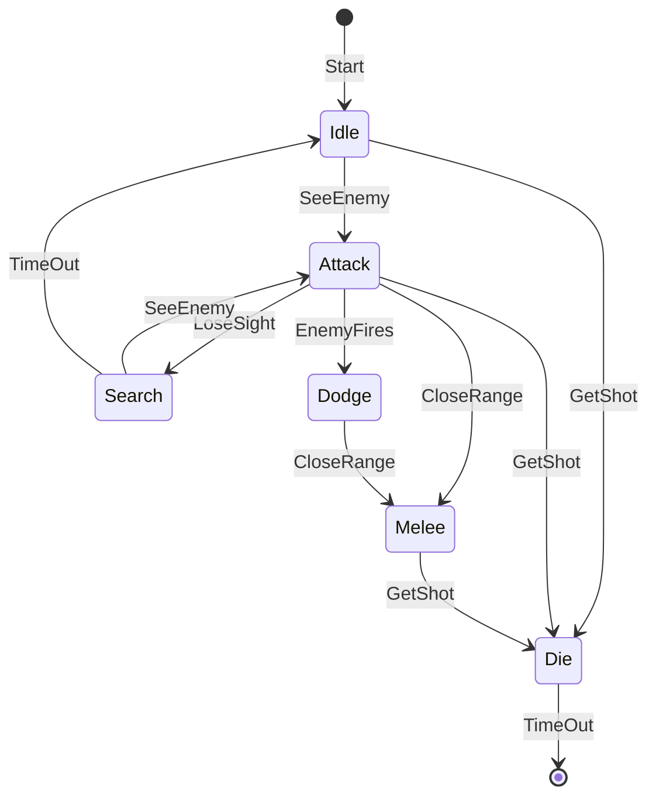

# FiniteStateMachineExample
A basic finite state machine example modelled around a fight with a monster.

## State Diagram

```mermaid
stateDiagram
    [*] --> Idle : Start
    Idle --> Die : GetShot
    Idle --> Attack : SeeEnemy

    Die --> [*] : TimeOut

    Attack --> Die : GetShot
    Attack --> Search : LoseSight
    Attack --> Dodge : EnemyFires
    Attack --> Melee : CloseRange

    Dodge --> Melee : CloseRange

    Melee --> Die : GetShot

    Search --> Attack : SeeEnemy
    Search --> Idle : TimeOut
```
